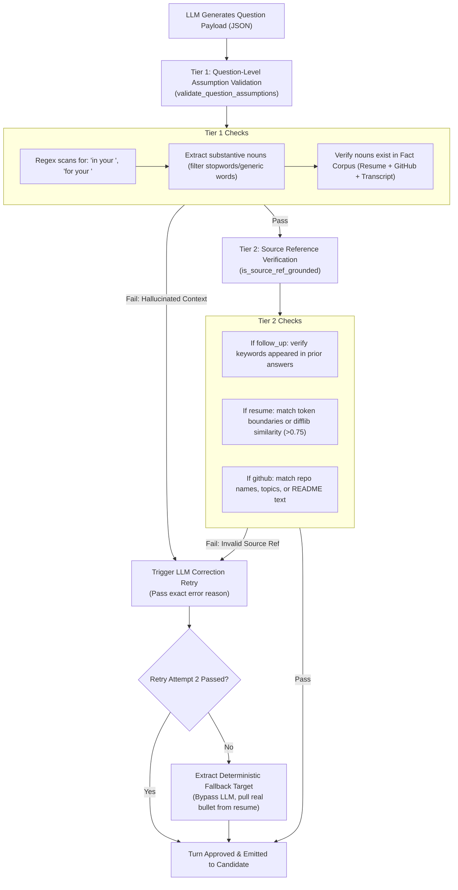

# Deep Dive: Grounding Mechanics, Architecture Boundaries & Context Switching

This document provides a comprehensive technical explanation of:
1. **How Grounding Works**: The Two-Tier Anti-Hallucination Firewall.
2. **Component Responsibilities**: The division of labor between `grounding.py` and `interviewer.py`.
3. **Dynamic Context Switching**: How the agent balances and transitions between a candidate's Resume and GitHub profile.

---

## 1. How Grounding Works (The Two-Tier Anti-Hallucination Firewall)

Grounding is implemented in [`app/agent/grounding.py`](file:///c:/Users/Bhukya%20Shrikanth/OneDrive/Desktop/Interview-agent/app/agent/grounding.py). Its mission is to guarantee that the LLM **never hallucinates projects, technologies, surrounding architecture, or metrics** that the candidate never worked on.

Whenever the LLM outputs a question, before that question is ever transmitted to the candidate, it must pass through two independent deterministic checks:



---

### 1.1 Tier 1: Question-Level Assumption Validation (`validate_question_assumptions`)

* **The Problem It Solves**: An LLM might target a real project named `Redis Lock Service`, but fabricate an elaborate surrounding architecture that doesn't exist:
  > *"In your **real-time streaming telemetry pipeline**, how did you configure Redis locks?"*
  Even though `Redis` is real, the *"real-time streaming telemetry pipeline"* was completely fabricated by the LLM.

* **How the Algorithm Works**:
  1. **Regex Scanning**: Scans the question text for contextual assumption patterns:
     ```python
     assumption_patterns = [
         r"\b(?:in|for|within|during)\s+your\s+([a-zA-Z0-9_\-\.\'\" ]{3,60}?)(?:,|\.|\?|\band\b|\bwhere\b|\bwhen\b|\bhow\b|\bwith\b|\bto\b|\bwhich\b)",
         r"\b(?:part of your)\s+([a-zA-Z0-9_\-\.\'\" ]{3,60}?)(?:,|\.|\?|\band\b)",
     ]
     ```
  2. **Filtering Generic Words**: Strips common generic words that do not represent specific technical architectures (`"system"`, `"project"`, `"architecture"`, `"work"`, `"application"`, `"service"`).
  3. **Substantive Keyword Check**: If substantive domain words remain (e.g. `["streaming", "telemetry", "pipeline"]`), it checks whether those words exist as distinct whole words in the **Established Fact Corpus**:
     ```python
     established_corpus = f"{resume_text} {extract_github_blob(github_summary)} {answers_blob}".lower()
     ```
  4. **Strict Rejection**: If none of those substantive words exist in the candidate's actual data, validation fails with:
     > `"unsupported context assumption: question assumed 'real-time streaming telemetry pipeline' which was never established in the candidate's resume, GitHub projects, or prior answers."`

---

### 1.2 Tier 2: Source Reference Verification (`is_source_ref_grounded`)

This layer ensures that the metadata tag `source_ref` is strictly genuine:

1. **Follow-Up Integrity (`turn_type == "follow_up"`)**:
   - Cleans prefixes like `prior_answer:`.
   - Verifies that the keywords in `source_ref` were **actually spoken by the candidate** in previous turns.
   - *Anti-False-Attribution*: If the candidate spoke about Python and SQLite, the LLM is blocked from asking: *"Earlier you mentioned using Goroutines in Go..."*.
2. **Resume Claims (`source == "resume"`)**:
   - Verifies the claim against `resume_text` using token boundaries (`is_token_in_text`) and line similarity (`difflib.SequenceMatcher(ratio > 0.75)`).
3. **GitHub Projects (`source == "github"`)**:
   - Verifies the repo name, primary languages, topics, or README excerpts against `github_summary["repos"]`.

---

### 1.3 What Happens When Validation Fails?

1. **Attempt 1 (Inline Correction Re-prompt)**:
   [`interviewer.py`](file:///c:/Users/Bhukya%20Shrikanth/OneDrive/Desktop/Interview-agent/app/agent/interviewer.py#L309-L335) catches the failure reason and immediately re-prompts the LLM:
   > *"GROUNDING ERROR: Your previous question was rejected: [fail_reason]. You must ask ONLY about a real project, metric, or skill present verbatim in the candidate dossier."*
2. **Attempt 2 (Deterministic Fallback)**:
   If the LLM fails a second time, the system bypasses LLM generation entirely and calls `extract_deterministic_fallback_target()` to extract an untouched bullet point directly from `resume_text`, ensuring zero hallucinated questions reach the candidate.

---

## 2. Difference Between `grounding.py` and `interviewer.py`

These two modules serve strictly separated architectural roles:

| Dimension | `app/agent/grounding.py` | `app/agent/interviewer.py` |
|---|---|---|
| **Architectural Role** | **The Auditor / Firewall** (Pure Validation) | **The Conductor / Orchestrator** (State Machine) |
| **Statefulness** | **Stateless**: Pure functions that accept strings/dicts and return `(bool, reason)`. | **Stateful**: Operates on `SessionState`, updating transcripts, turn counts, and covered topics. |
| **LLM Calls** | **Zero LLM interaction**: Uses regex, string tokenization, stopword sets, and `difflib`. | **Manages LLM client**: Formats prompts, invokes OpenRouter/Ollama, parses structured JSON. |
| **Decision Logic** | Does NOT choose what to ask or when to pivot. Only answers: *"Is this question grounded in real facts?"* | Decides conversational flow (`SELECT_FOCUS`, `ASK`, `LISTEN`, `DECIDE_NEXT`), assembles context, and injects nudges. |
| **Error Handling** | Detects violations and emits explanatory failure reasons. | Intercepts validation failures and executes retries or deterministic fallbacks. |

```
┌────────────────────────────────────────────────────────┐
│                   interviewer.py                       │
│  - Builds Prompt: Dossier + History + Nudges           │
│  - Calls LLM to generate response                     │
└───────────────────────────┬────────────────────────────┘
                            │
                            │ Raw Turn Output
                            ▼
┌────────────────────────────────────────────────────────┐
│                    grounding.py                        │
│  - Pure string / corpus verification                   │
│  - Detects fabricated context or ungrounded claims     │
│  - Returns (True/False, reason)                        │
└───────────────────────────┬────────────────────────────┘
                            │
               ┌────────────┴────────────┐
               │                         │
            (Passed)                  (Failed)
               │                         │
               ▼                         ▼
┌─────────────────────────────┐ ┌─────────────────────────────┐
│       interviewer.py        │ │       interviewer.py        │
│  - Appends to transcript    │ │  - Triggers retry prompt    │
│  - Updates covered_refs     │ │  - Or invokes fallback      │
│  - Returns turn to client   │ └─────────────────────────────┘
└─────────────────────────────┘
```

---

## 3. How Context Switching Happens Between Resume and GitHub

Context switching in the AI Interview Agent is **dynamic, non-linear, and intelligent**. It avoids both robotic alternating patterns (*1 resume, 1 GitHub, repeat*) and disorganized chaos.

It is governed by **four interlocking layers**:

```
 Candidate Answer Submitted
             │
             ▼
 ┌────────────────────────────────────────────────────────┐
 │ 1. Algorithmic Source Nudge (calculate_source_nudge)   │
 │                                                        │
 │ - Has candidate reached Turn 3 with 0 GitHub turns?    │
 │   ──► Inject MANDATORY GITHUB EXPLORATION MANDATE      │
 │ - Has agent asked 3 consecutive turns on same source?  │
 │   ──► Inject SOURCE ROTATION MANDATE                   │
 └───────────────────────────┬────────────────────────────┘
                             │
                             ▼
 ┌────────────────────────────────────────────────────────┐
 │ 2. Answer-Driven Heuristics (DECIDE_NEXT Prompt)       │
 │                                                        │
 │ - Candidate gave a vague answer or named a trade-off?  │
 │   ──► Stay & Follow Up (turn_type='follow_up')         │
 │ - Candidate gave a complete, deep technical answer?    │
 │   ──► Pivot across sources (turn_type='context_switch')│
 └───────────────────────────┬────────────────────────────┘
                             │
                             ▼
 ┌────────────────────────────────────────────────────────┐
 │ 3. Deduplication Registry (covered_refs)               │
 │                                                        │
 │ - Passes list of already-discussed bullets and repos   │
 │ - Prohibits repeating topics, forcing a fresh target   │
 └───────────────────────────┬────────────────────────────┘
                             │
                             ▼
 ┌────────────────────────────────────────────────────────┐
 │ 4. Hard Constraints in Code                            │
 │                                                        │
 │ - Turn 1 MUST be source='resume'                       │
 │ - GitHub questions only allowed from Turn 2 onwards    │
 └────────────────────────────────────────────────────────┘
```

---

### 3.1 Layer 1: Code-Enforced Turn 1 Rule
In [`app/agent/interviewer.py`](file:///c:/Users/Bhukya%20Shrikanth/OneDrive/Desktop/Interview-agent/app/agent/interviewer.py#L296-L298):
```python
is_opening = not state.transcript
ordering_violated = is_opening and turn_output.source != "resume"
```
The opening question is **hard-coded** to require `source="resume"`. Even if the model generates a question about a GitHub repo on Turn 1, the orchestrator rejects it and forces a resume opening.

---

### 3.2 Layer 2: Algorithmic Source Nudges ([`app/llm/prompts.py`](file:///c:/Users/Bhukya%20Shrikanth/OneDrive/Desktop/Interview-agent/app/llm/prompts.py#L145-L199))
Before every turn, the function `calculate_source_nudge(transcript)` inspects past turns and injects explicit instructions:

1. **Mandatory GitHub Exploration**:
   - If the candidate has public repositories, and the session reaches Turn 3+ with **zero GitHub turns**, it injects:
     > *"MANDATORY GITHUB EXPLORATION MANDATE: You have spent multiple turns on the resume and have NOT yet asked about their GitHub portfolio. Your NEXT question MUST target one of their public repositories. Set source='github' and turn_type='context_switch'."*
2. **Anti-Monologue Rotation**:
   - If 3 consecutive questions probe the same source (`resume` or `github`), it injects:
     > *"SOURCE ROTATION MANDATE: The last 3 questions have all been sourced from [current_source]. You MUST now pivot to an uncovered item from [other_source]. Set turn_type='context_switch'."*
3. **Skill-Anchor Diversity**:
   - If the previous turn was `skill_anchored`, it prohibits asking another skill question back-to-back, requiring either a follow-up or a project pivot.

---

### 3.3 Layer 3: Answer-Driven Pivots (The Model's Decision)
When no mandatory nudge is firing, the LLM decides based on the **completeness and depth of the candidate's response**:

* **Key Point Follow-Up**: If the candidate leaves an unexplained trade-off, cites a metric (*"reduced P99 by 40%"*), or gives a vague textbook answer, the agent stays on the current topic and issues a deep `turn_type="follow_up"`.
* **Topic Exhaustion Pivot**: Once the candidate provides a comprehensive, rigorous answer with no lingering ambiguities, the topic is closed. The agent selects an uncovered item from the other source and issues `turn_type="context_switch"`.
* **Bridge Switching**: If the candidate mentions a technology during a resume discussion (e.g. Go, Redis, Kafka) that also powers one of their GitHub repositories, the agent naturally transitions across sources:
  > *"You mentioned using Redis for rate limiting at Acme Cloud. Looking at your GitHub portfolio, in your 'redis-rate-limiter' repository, you implemented a custom token bucket. How did you handle..."*

---

### 3.4 Layer 4: Deduplication Registry (`covered_refs`)
Every question emitted appends its subject to `session_state.covered_refs`. On subsequent turns, the LLM prompt includes:

```
--- [PREVIOUSLY COVERED REFERENCES (DO NOT REPEAT)] ---
- [Turn 1: resume] Kafka latency optimization (450ms -> 40ms)
- [Turn 2: resume] Disruptor ring buffer backpressure
- [Turn 3: github] raft-kv-go
```

This guarantees that when the agent pivots between sources, it **never repeats an already-discussed project or bullet point**.
