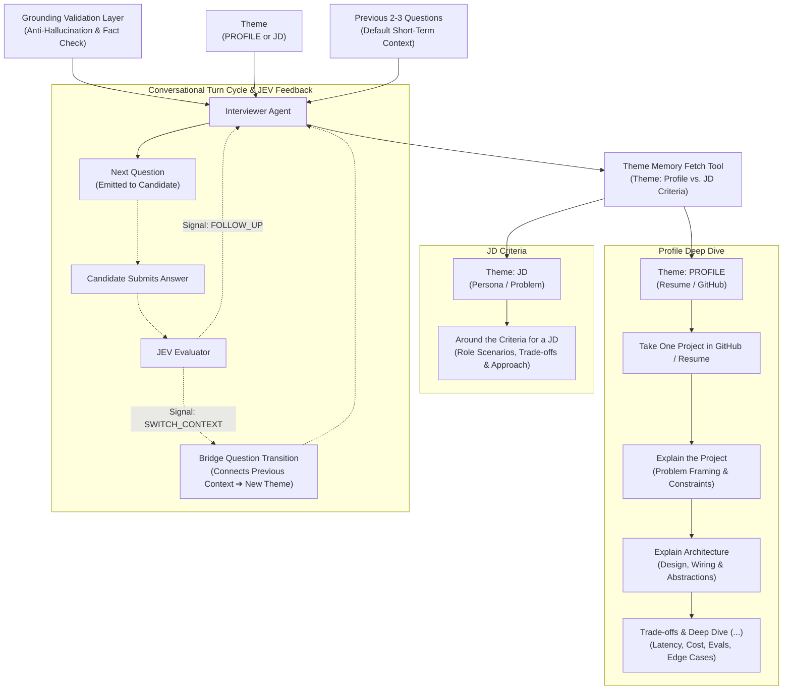

# Design Spec: Interviewer & Hierarchical Memory Architecture Redesign

- **Date**: 2026-09-30
- **Status**: Draft / Awaiting Review
- **Author**: Pair Programming with AI Assistant
- **Target Subsystems**: `app/agent/interviewer.py`, `app/session/state.py`, `app/llm/prompts.py`

---

## 1. Executive Summary & Problem Statement

### 1.1 The Problem
In the original design, the Interviewer Agent maintained a flat, monolithic session state. On every conversational turn, the entire raw resume, all public GitHub repositories, the entire covered reference list, and the complete transcript history were concatenated and passed to the LLM. 

This led to several critical failure modes:
1. **Prompt Bloat & Token Degradation**: By turn 8–10, the prompt contained thousands of tokens, increasing API latency and costs.
2. **Attention Diffusion**: The LLM frequently lost focus on the candidate's active project, drifting between different repositories and resume claims.
3. **Cross-Project Contamination**: The LLM occasionally conflated technologies from Repo A with Repo B because both source schemas were concurrently present in context.
4. **Generic Questioning**: Without structured progression, questions tended toward textbook knowledge checks (e.g., *"What is RAG?"*) rather than probing hands-on decisions, architecture, and trade-offs.

### 1.2 Core Architectural Principles
- **NO RAG / NO VECTOR DB**: As specified in `AGENTS.md`, we strictly avoid embeddings, vector stores (Pinecone, Chroma, FAISS), and chunked retrieval.
- **Deterministic Scoped Context Assembly**: Sub-memories and source slices are organized into clean Python dictionaries. At runtime, the agent pulls *only* the active source slice, the active sub-memory, and a short-term sliding window of the last 2–3 turns.
- **Approach & Trade-off Focus**: Questions avoid basic definitions and specifically probe candidate intent, architecture decisions, trade-offs, and failure mitigations.

---

## 2. System Architecture & The Two Themes



### 2.1 The Two Themes
1. **`PROFILE` Theme**:
   - Focuses on what the candidate has *actually built*.
   - Evaluates real experience via Resume claims or GitHub repositories.
   - Drills into one project at a time across structured dimensions:
     1. *Project Context*: Problem statement, user constraints, measurable goals (`clarity_of_framing`).
     2. *System Architecture*: Framework integration, component wiring, abstractions (`methodology_depth`, `ai_tool_integration`).
     3. *Trade-offs & Edge Cases*: Latency, cost, evaluations, safety, failure mitigations (`feasibility`, `ml_technical_depth`).
2. **`JD` Theme**:
   - Focuses on the candidate's *problem-solving ability and architectural reasoning*.
   - Grounded in realistic role criteria and problem statements rather than reciting raw JD requirements.
   - Poses concrete system design scenarios and probes trade-offs, scaling limits, and failure modes.

### 2.2 Turn 1: Random Theme Selection
At session initialization, the agent randomly picks either `PROFILE` or `JD` as its opening theme. This introduces realistic conversational variety across candidates while ensuring full coverage across the entire 25-minute interview.

---

## 3. The Conversational Turn Loop & External Signals

### 3.1 JEV Handshake (Evaluator / Supervisor)
The internal `interviewer.py` state machine does not make subjective follow-up decisions alone. After the candidate submits an answer, the answer and turn metadata are submitted to the external `jev` evaluator.

`jev` returns one of two actionable signals:
1. `FOLLOW_UP`: The candidate's answer introduces concrete technical points or lacks architectural depth. The Interviewer remains in the current sub-memory and probes deeper using the previous 2–3 Q/As as short-term context.
2. `SWITCH_CONTEXT`: The active project or scenario is sufficiently exhausted. The agent must pivot to a new project or switch themes.

### 3.2 Bridge Questions (Context Switching)
When `jev` signals `SWITCH_CONTEXT`, the agent transitions using a **Bridge Question** instead of making an abrupt, disjointed jump.

- **Profile $\rightarrow$ JD Bridge Example**:
  *"In your `distributed-cache` repo, you implemented a probabilistic early expiration algorithm to mitigate cache stampedes. In our ingestion pipeline, we deal with severe traffic surges where cache misses can cascade to downstream databases. How would you adapt your caching approach to protect our services under those conditions?"*
- **Resume $\rightarrow$ GitHub Bridge Example**:
  *"On your resume you highlighted reducing p99 latency by 35% on an analytics ingestion service. Looking at your `fast-analytics` repository, how did your custom ring buffer design directly deliver that 35% improvement?"*

### 3.3 The 25-Minute Session Budget Guardrail
- **Target Session Duration**: $\le 25$ minutes total (approximately 10–12 conversational turns).
- **Time Check**: At the start of every turn:
  $$\text{elapsed\_time} = \text{now}() - \text{start\_time}$$
- If $\text{elapsed\_time} \ge 22\text{ minutes}$ OR $\text{turn\_count} \ge 11$, any `FOLLOW_UP` or `SWITCH_CONTEXT` signal is overridden by a `CLOSING` action.
- The Interviewer produces a professional closing turn thanking the candidate and concluding the interview.

---

## 4. Memory Architecture Specification

Memory is partitioned into three distinct tiers:

### 4.1 Tier 1: Static Source Memory (Read-Only)
Loaded once at session start and indexed by ID:
- `resume_data`: Full text + parsed claims/skills.
- `github_data`: Repository dictionary keyed by `repo_name` (README excerpts, dependencies, primary architecture files).
- `jd_data`: Role requirements and catalog of concrete problem scenarios.
- `role_rubric`: Role grading persona and assessment dimensions (e.g. AI Engineer evaluation schema).

### 4.2 Tier 2: Global Session Memory (`session_memory.json`)
The top-level coordinator tracking overall progress, time limits, and cross-topic anti-duplication:

```json
{
  "session_id": "sess_intv_98234a1b",
  "status": "active",
  "created_at": "2026-09-30T17:00:00Z",
  "updated_at": "2026-09-30T17:14:22Z",
  "session_budget": {
    "max_duration_seconds": 1500,
    "elapsed_seconds": 862,
    "max_turns": 12,
    "current_turn": 6,
    "closing_triggered": false
  },
  "orchestration_state": {
    "active_theme": "PROFILE",
    "active_context_id": "github:distributed-cache",
    "turns_in_active_context": 3,
    "last_jev_signal": "SWITCH_CONTEXT",
    "theme_switch_pending": true,
    "theme_execution_history": [
      {
        "theme": "PROFILE",
        "context_id": "github:distributed-cache",
        "turns_spent": 3,
        "status": "completed"
      }
    ]
  },
  "anti_duplication_index": {
    "covered_topics": [
      "Redis TTL eviction wheel",
      "Cache stampede mitigation",
      "Lock contention handling"
    ],
    "covered_sources": [
      "github:distributed-cache"
    ]
  },
  "recent_dialogue_window": [
    {
      "turn_index": 4,
      "role": "interviewer",
      "content": "Looking at your distributed-cache repo, how did you handle lock contention during concurrent cache stampedes?",
      "theme": "PROFILE",
      "context_id": "github:distributed-cache",
      "rubric_dimension": "methodology_depth"
    },
    {
      "turn_index": 5,
      "role": "candidate",
      "content": "We implemented a mutex lock with probabilistic early expiration..."
    },
    {
      "turn_index": 6,
      "role": "interviewer",
      "content": "What were the trade-offs of serving stale data versus blocking requests?",
      "theme": "PROFILE",
      "context_id": "github:distributed-cache",
      "rubric_dimension": "feasibility"
    }
  ],
  "sub_memory_registry": {
    "profile_contexts": ["github:distributed-cache"],
    "jd_contexts": ["jd:high_throughput_ingestion"]
  }
}
```

### 4.3 Tier 3: Context Sub-Memories (`sub_memories/{context_id}.json`)
Each sub-memory represents an isolated technical deep-dive:

```json
{
  "context_id": "github:distributed-cache",
  "theme": "PROFILE",
  "source_ref": "distributed-cache",
  "source_slice": {
    "description": "High-throughput in-memory caching daemon with custom TTL and eviction",
    "language": "Python",
    "primary_abstractions": ["TTLWheel", "MutexLockTable", "EvictionPolicy"]
  },
  "probed_dimensions": ["clarity_of_framing", "methodology_depth", "feasibility"],
  "pending_dimensions": ["ml_technical_depth"],
  "turns": [
    {
      "turn_index": 4,
      "question": "Looking at your distributed-cache repo, how did you handle lock contention during concurrent cache stampedes?",
      "answer": "We implemented a mutex lock with probabilistic early expiration...",
      "rubric_dimension": "methodology_depth"
    }
  ],
  "extracted_takeaways": {
    "locking": "Employed mutex locks at key-level rather than global daemon locks",
    "consistency_trade_off": "Favors availability over immediate strong consistency"
  }
}
```

---

## 5. The "Theme Memory Fetch Tool"

The Fetch Tool is implemented as an internal Python selector within `interviewer.py` rather than an LLM tool call. This guarantees **zero extra latency**, deterministic reliability, and single-turn LLM generation.

### 5.1 Retrieval Logic
- **Single-Context Follow-up**:
  - Pulls `active_sub_memory.source_slice`.
  - Determines the next target rubric dimension from `pending_dimensions`.
  - Attaches `recent_dialogue_window` (last 2–3 turns).
  - Emits instructions: *"Probe candidate's last answer focusing on [next_dimension] in project [source_ref]."*
- **Composite Bridge Fetch**:
  - Pulls the **Anchor Slice**: key technical choice from `active_sub_memory`.
  - Pulls the **Target Slice**: new project or JD problem statement.
  - Attaches `recent_dialogue_window`.
  - Emits instructions: *"Construct a bridge question linking candidate's approach in [Anchor] with the requirements in [Target]."*

---

## 6. Failure Modes & Mitigations

| Failure Mode | Risk | Built-in Mitigation |
| :--- | :--- | :--- |
| **Context Blindness / Pronoun Loss** | Removing past turns might cause LLM to lose conversational flow. | The `recent_dialogue_window` always retains the last 2–3 turns verbatim, preserving pronoun resolution and immediate conversational context. |
| **Topic Duplication Across Themes** | Asking about Redis or Kafka twice when switching between Profile and JD. | The global `anti_duplication_index.covered_topics` list is injected as a negative constraint (*"Do not re-probe already covered concepts"*). |
| **Cross-Project Hallucination** | LLM mentions Repo B files while asking about Repo A. | Physical omission: Repo B's data is completely absent from the prompt during Repo A's active turn. |
| **Abrupt Conversational Pivots** | The agent suddenly jumps from deep technical code to a generic scenario. | Composite Bridge Questions require the agent to verbally link the candidate's prior statement to the upcoming scenario. |
| **Session Overrun** | Deep dives cause the interview to exceed 25 minutes. | Clock-driven session budget forces graceful conclusion starting at 22 minutes or turn 11. |

---

## 7. Migration & Codebase Touchpoints

1. **`app/session/state.py`**:
   - Introduce `ContextSubMemory`, `TurnRecord`, `SessionBudget`, and `OrchestrationState` models.
   - Refactor `SessionState` to store sub-memories dictionary and sliding window.
2. **`app/agent/interviewer.py`**:
   - Replace monolithic `_build_conversation_messages` with scoped assembly.
   - Implement `_fetch_theme_slice` and `_build_bridge_context`.
   - Add JEV signal handler (`handle_jev_signal`).
   - Add session budget timer checks.
3. **`app/agent/grounding.py`**:
   - Grounding validation remains fully active: verify that `source_ref` belongs to the active slice and assumptions match the active sub-memory.
