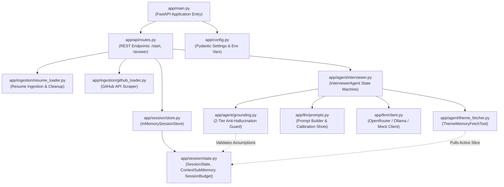
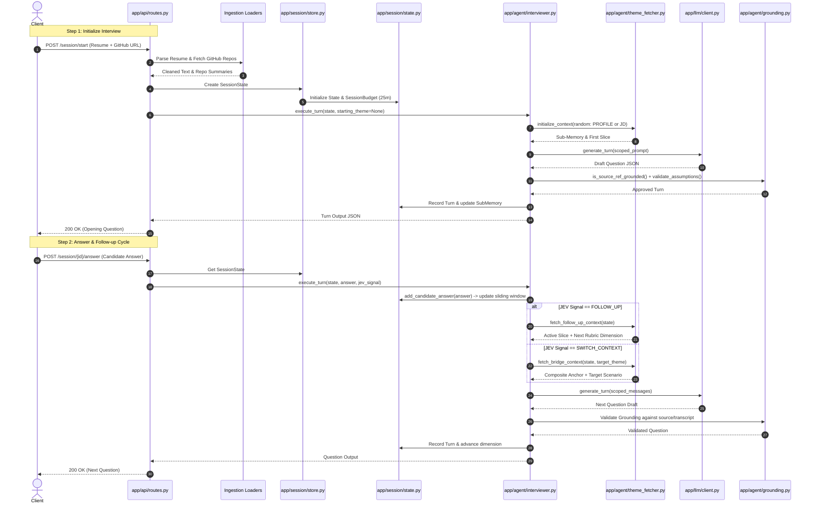

# 01. System Architecture & Module Linkages

[← Back to Wiki Index](file:///c:/Users/Bhukya%20Shrikanth/OneDrive/Desktop/Interview-agent/wiki/INDEX.md)

---

## 🏛️ Architecture Overview

The **AI Interview Agent** backend is structured as an autonomous, state-machine driven conversational service. It conducts technical interviews grounded in a candidate's resume, public GitHub portfolio, and job criteria without vector databases or chunked RAG.

### Architectural Philosophy
1. **Context Window Reasoning**: The candidate's full profile and JD scenarios comfortably fit in modern LLM context windows. We use Python dictionary scoping rather than semantic embeddings.
2. **Deterministic Scoped Assembly**: Instead of passing all data on every turn, the agent pulls only the active project or scenario, reducing prompt size from ~5,000+ tokens to ~800–1,200 tokens.
3. **Decoupled Evaluator Handshake**: Depth decisions (`FOLLOW_UP` vs. `SWITCH_CONTEXT`) are consumed from an external evaluation module (`jev`), keeping the interviewer lean and focused on conversational excellence.

---

## 📦 Module Dependency & Call Graph

---

## 📂 Codebase Directory Topology

| Directory | Core Responsibility | Key Files |
| :--- | :--- | :--- |
| [`app/api/`](file:///c:/Users/Bhukya%20Shrikanth/OneDrive/Desktop/Interview-agent/app/api) | FastAPI route handlers, Pydantic request/response schemas, error handling | [`routes.py`](file:///c:/Users/Bhukya%20Shrikanth/OneDrive/Desktop/Interview-agent/app/api/routes.py), [`schemas.py`](file:///c:/Users/Bhukya%20Shrikanth/OneDrive/Desktop/Interview-agent/app/api/schemas.py) |
| [`app/session/`](file:///c:/Users/Bhukya%20Shrikanth/OneDrive/Desktop/Interview-agent/app/session) | Stateful interview representations: 3-tier memory model, budget timers, in-memory registry | [`state.py`](file:///c:/Users/Bhukya%20Shrikanth/OneDrive/Desktop/Interview-agent/app/session/state.py), [`store.py`](file:///c:/Users/Bhukya%20Shrikanth/OneDrive/Desktop/Interview-agent/app/session/store.py) |
| [`app/agent/`](file:///c:/Users/Bhukya%20Shrikanth/OneDrive/Desktop/Interview-agent/app/agent) | Core state machine coordinator, theme memory routing, and code-level grounding layer | [`interviewer.py`](file:///c:/Users/Bhukya%20Shrikanth/OneDrive/Desktop/Interview-agent/app/agent/interviewer.py), [`theme_fetcher.py`](file:///c:/Users/Bhukya%20Shrikanth/OneDrive/Desktop/Interview-agent/app/agent/theme_fetcher.py), [`grounding.py`](file:///c:/Users/Bhukya%20Shrikanth/OneDrive/Desktop/Interview-agent/app/agent/grounding.py) |
| [`app/llm/`](file:///c:/Users/Bhukya%20Shrikanth/OneDrive/Desktop/Interview-agent/app/llm) | Outbound LLM HTTP clients, system prompts, few-shot calibration, and bridge formatters | [`client.py`](file:///c:/Users/Bhukya%20Shrikanth/OneDrive/Desktop/Interview-agent/app/llm/client.py), [`prompts.py`](file:///c:/Users/Bhukya%20Shrikanth/OneDrive/Desktop/Interview-agent/app/llm/prompts.py) |
| [`app/ingestion/`](file:///c:/Users/Bhukya%20Shrikanth/OneDrive/Desktop/Interview-agent/app/ingestion) | Parsing raw resume text/PDF and pulling GitHub public repositories via REST API | [`resume_loader.py`](file:///c:/Users/Bhukya%20Shrikanth/OneDrive/Desktop/Interview-agent/app/ingestion/resume_loader.py), [`github_loader.py`](file:///c:/Users/Bhukya%20Shrikanth/OneDrive/Desktop/Interview-agent/app/ingestion/github_loader.py) |
| [`tests/`](file:///c:/Users/Bhukya%20Shrikanth/OneDrive/Desktop/Interview-agent/tests) | Unit, integration, grounding, and E2E simulation test suites | [`test_e2e_hierarchical_interview.py`](file:///c:/Users/Bhukya%20Shrikanth/OneDrive/Desktop/Interview-agent/tests/test_e2e_hierarchical_interview.py) |

---

## 🔄 End-to-End Data Flow

---

[Next: 02. Memory & State Graph →](file:///c:/Users/Bhukya%20Shrikanth/OneDrive/Desktop/Interview-agent/wiki/02_MEMORY_AND_STATE_GRAPH.md)
