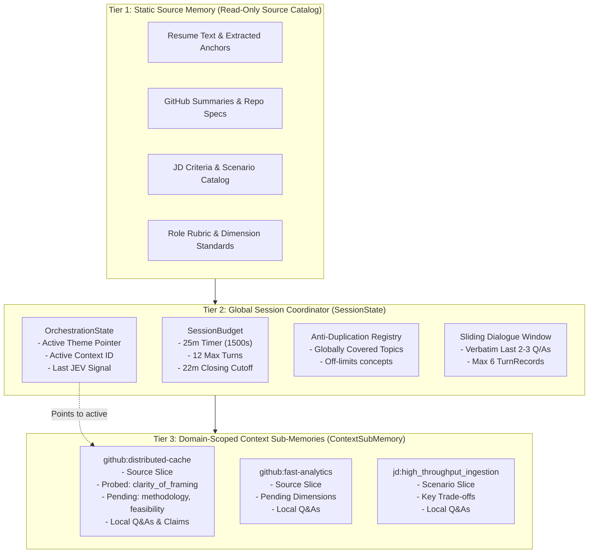
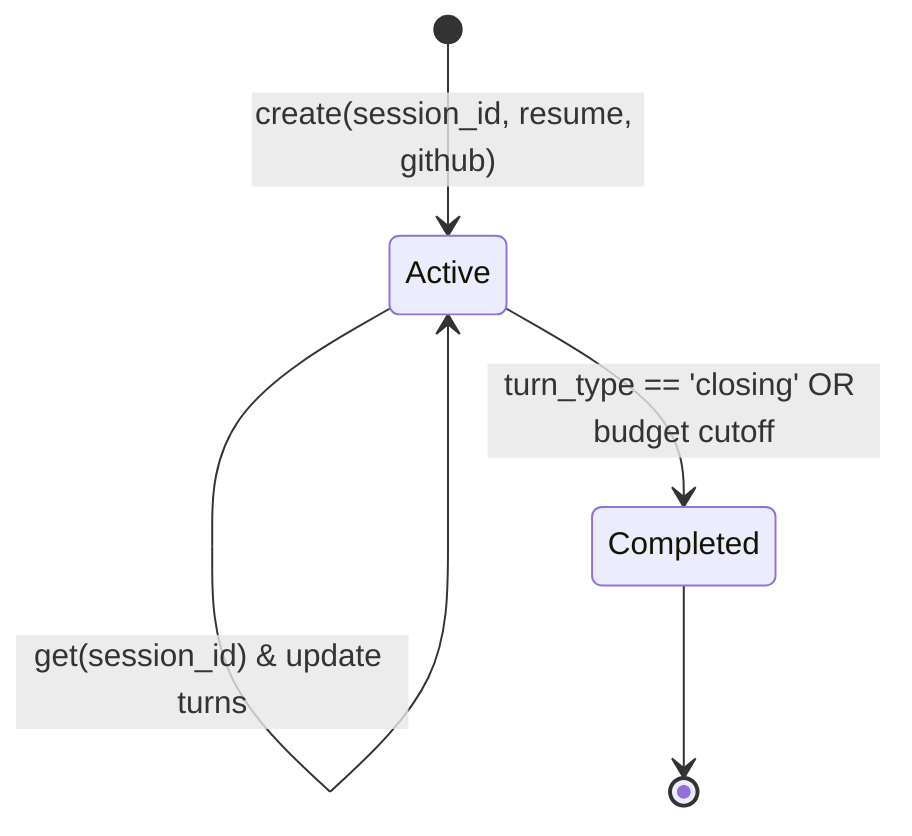

# 02. Memory & State Machine Graph

[← Back to Wiki Index](file:///c:/Users/Bhukya%20Shrikanth/OneDrive/Desktop/Interview-agent/wiki/INDEX.md) | [Next: 03. Themes & Interviewer Engine →](file:///c:/Users/Bhukya%20Shrikanth/OneDrive/Desktop/Interview-agent/wiki/03_THEMES_AND_INTERVIEWER.md)

---

## 🧠 The 3-Tier Hierarchical Memory Architecture

Rather than maintaining a flat, ever-growing transcript that dilutes the LLM's attention, the system implements a **3-tier hierarchical memory model** defined in [`app/session/state.py`](file:///c:/Users/Bhukya%20Shrikanth/OneDrive/Desktop/Interview-agent/app/session/state.py).



---

## 🧩 Model Specifications & Code Links

### 1. `ContextSubMemory` (Domain-Scoped Bucket)
Defined in [`app/session/state.py`](file:///c:/Users/Bhukya%20Shrikanth/OneDrive/Desktop/Interview-agent/app/session/state.py#L95-L135).
- Each project or JD scenario receives an isolated sub-memory.
- Tracks the depth progression across rubric dimensions:
  `["clarity_of_framing", "methodology_depth", "feasibility"]`
- When a dimension is probed, `record_turn()` automatically moves it from `pending_dimensions` to `probed_dimensions`.

```python
# Code reference: app/session/state.py
sub = ContextSubMemory(
    context_id="github:distributed-cache",
    theme="PROFILE",
    source_ref="distributed-cache",
    source_slice={...},
    pending_dimensions=["clarity_of_framing", "methodology_depth", "feasibility"],
)
```

### 2. `SessionBudget` (25-Minute Guardrail)
Defined in [`app/session/state.py`](file:///c:/Users/Bhukya%20Shrikanth/OneDrive/Desktop/Interview-agent/app/session/state.py#L137-L151).
- Tracks `start_time`, `max_duration_seconds = 1500` (25 mins), and `max_turns = 12`.
- `is_closing_time`: Computes `(now - start_time) >= 1320` (22 minutes).
- When triggered, `InterviewerAgent` overrides any follow-up or theme switch, emitting a graceful concluding turn.

### 3. `recent_dialogue_window` (The Sliding Dialogue Window)
Defined in [`app/session/state.py`](file:///c:/Users/Bhukya%20Shrikanth/OneDrive/Desktop/Interview-agent/app/session/state.py#L175-L215).
- Retains strictly the **last 2–3 conversational turns** (max 6 `TurnRecord` objects).
- Eliminates context dilution while guaranteeing seamless pronoun resolution (*"In that project you just mentioned..."*).

---

## 📊 Concrete JSON State Snapshots

### Global Session Memory (`session_memory.json`)
```json
{
  "session_id": "sess_intv_98234a1b",
  "status": "active",
  "budget": {
    "max_duration_seconds": 1500,
    "max_turns": 12,
    "elapsed_seconds": 862,
    "is_closing_time": false
  },
  "orchestration": {
    "active_theme": "PROFILE",
    "active_context_id": "github:distributed-cache",
    "turns_in_active_context": 2,
    "last_jev_signal": "FOLLOW_UP",
    "theme_switch_pending": false
  },
  "globally_covered_topics": [
    "distributed-cache",
    "Redis TTL eviction wheel",
    "Cache stampede mitigation"
  ],
  "recent_dialogue_window": [
    {
      "turn_index": 3,
      "role": "interviewer",
      "content": "Looking at distributed-cache, how did you handle lock contention during stampedes?",
      "theme": "PROFILE",
      "context_id": "github:distributed-cache",
      "rubric_dimension": "methodology_depth"
    },
    {
      "turn_index": 3,
      "role": "candidate",
      "content": "We implemented a mutex lock with probabilistic early expiration.",
      "theme": "PROFILE",
      "context_id": "github:distributed-cache"
    }
  ]
}
```

### Context Sub-Memory (`sub_memories/github_distributed-cache.json`)
```json
{
  "context_id": "github:distributed-cache",
  "theme": "PROFILE",
  "source_ref": "distributed-cache",
  "source_slice": {
    "type": "github_repository",
    "repo_name": "distributed-cache",
    "description": "High-concurrency cache daemon",
    "language": "Python"
  },
  "probed_dimensions": ["clarity_of_framing", "methodology_depth"],
  "pending_dimensions": ["feasibility"],
  "turns": [
    {
      "turn_index": 1,
      "role": "interviewer",
      "content": "Walk me through the core problem distributed-cache was built to solve.",
      "rubric_dimension": "clarity_of_framing"
    },
    {
      "turn_index": 1,
      "role": "candidate",
      "content": "It addresses hot-key saturation on primary databases."
    }
  ],
  "extracted_takeaways": {
    "architecture": "Implemented client-side two-tier caching with Redis backing"
  }
}
```

---

## 🗄️ In-Memory Store Lifecycle

Managed by [`InMemorySessionStore`](file:///c:/Users/Bhukya%20Shrikanth/OneDrive/Desktop/Interview-agent/app/session/store.py):



- **Thread-safe**: Sessions are held in a Python dictionary protected by asynchronous execution semantics.
- **Zero ORM Overhead**: No SQLite or PostgreSQL dependencies; inspectable in-memory state.
