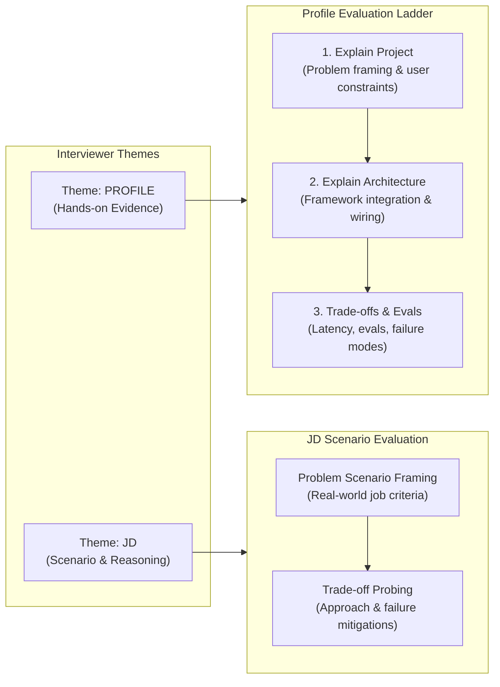
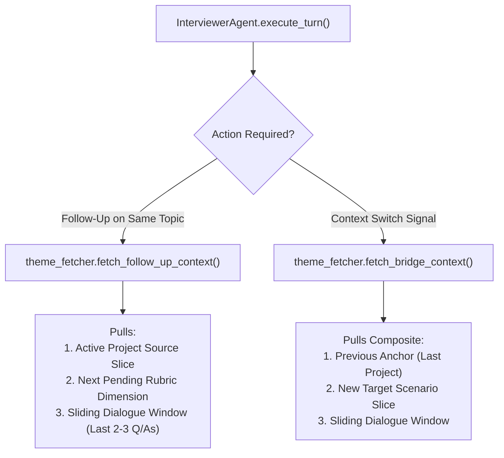
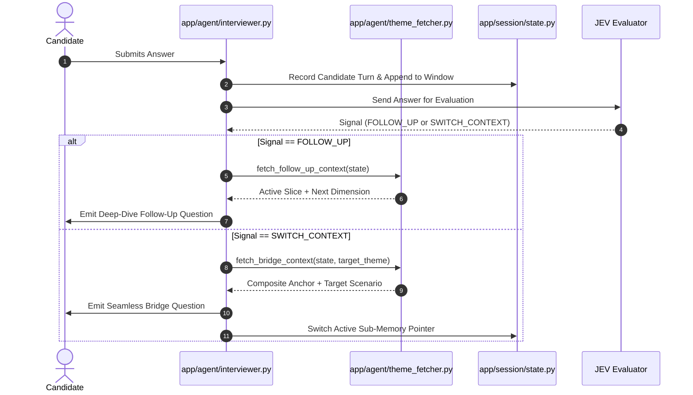

# 03. Themes & Interviewer Engine

[← Back to Wiki Index](file:///c:/Users/Bhukya%20Shrikanth/OneDrive/Desktop/Interview-agent/wiki/INDEX.md) | [Next: 04. Grounding & Anti-Hallucination Guardrails →](file:///c:/Users/Bhukya%20Shrikanth/OneDrive/Desktop/Interview-agent/wiki/04_GROUNDING_AND_GUARDRAILS.md)

---

## 🎯 The Two Internal Themes

The Interviewer Agent coordinates the technical inquiry across two primary themes, ensuring comprehensive evaluation without generic textbook trivia:

1. **`PROFILE` Theme**:
   - Evaluates **what the candidate has actually built**.
   - Drills down into **one project at a time** (either a GitHub repo or resume project).
   - Systematically progresses along the rubric ladder:
     - `clarity_of_framing`: User constraints and problem definition.
     - `methodology_depth` & `ai_tool_integration`: Component wiring and framework abstractions.
     - `feasibility` & `ml_technical_depth`: Concurrency, latency, cost, and failure modes.
2. **`JD` Theme**:
   - Evaluates **how the candidate approaches engineering scenarios**.
   - Grounded in realistic role criteria rather than reading out raw job bullets.
   - Probes scaling, trade-offs, and design decisions under real-world constraints.

---

## 🎲 Turn 1: Random Theme Selection

At session start, the agent executes a **random theme selection**:
- Code reference: [`app/agent/interviewer.py`](file:///c:/Users/Bhukya%20Shrikanth/OneDrive/Desktop/Interview-agent/app/agent/interviewer.py#L390-L405).
- If `PROFILE` is picked: Opens with a greeting anchored in their top GitHub repository or resume project.
- If `JD` is picked: Opens with an engineering scenario framed around the role criteria.

---

## 🛠️ The Theme Memory Fetch Tool

Implemented in [`app/agent/theme_fetcher.py`](file:///c:/Users/Bhukya%20Shrikanth/OneDrive/Desktop/Interview-agent/app/agent/theme_fetcher.py).
It is a **deterministic, zero-latency Python context selector** (no extra LLM calls or vector databases).

---

## 🌉 Bridge Questions (Context Switching)

When `jev` signals `SWITCH_CONTEXT`, the agent avoids abrupt, disjointed topic jumps by formulating a **Bridge Question**:
- Formatted via [`format_bridge_turn_prompt`](file:///c:/Users/Bhukya%20Shrikanth/OneDrive/Desktop/Interview-agent/app/llm/prompts.py#L250-L265).
- Connects the candidate's demonstrated approach in their previous project to the upcoming theme or scenario.

### Bridge Example: Profile $\rightarrow$ JD
> *"In your `distributed-cache` repo, you implemented probabilistic early expiration to mitigate cache stampedes. In our ingestion pipeline, we deal with severe traffic surges where cache misses can cascade to downstream databases.*  
> *How would you adapt your caching approach to protect our services under those conditions?"*

---

## 🔄 Turn-by-Turn Conversational Cycle

