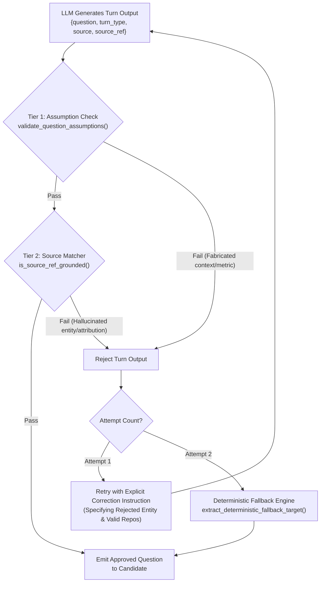

# 04. Grounding & Anti-Hallucination Guardrails

[← Back to Wiki Index](file:///c:/Users/Bhukya%20Shrikanth/OneDrive/Desktop/Interview-agent/wiki/INDEX.md) | [Next: 05. Ingestion Pipeline →](file:///c:/Users/Bhukya%20Shrikanth/OneDrive/Desktop/Interview-agent/wiki/05_INGESTION_PIPELINE.md)

---

## 🛡️ The 2-Tier Code-Level Grounding Layer

Implemented in [`app/agent/grounding.py`](file:///c:/Users/Bhukya%20Shrikanth/OneDrive/Desktop/Interview-agent/app/agent/grounding.py).
The Grounding Layer operates as an **automated, code-level anti-hallucination guard** that validates every proposed question before it reaches the candidate.

---

## 🔍 Validation Tiers Explained

### Tier 1: Question-Level Assumption Check
Function: [`validate_question_assumptions`](file:///c:/Users/Bhukya%20Shrikanth/OneDrive/Desktop/Interview-agent/app/agent/grounding.py#L185-L315)
- **Goal**: Catches fabricated surrounding context in the question text.
- **Pattern Matcher**: Scans for phrases like `"in your <phrase>"`, `"for your <phrase>"`, or `"the <tech> implementation in your <phrase>"`.
- **Corpus Verification**: Cross-references every assumed system against the established fact corpus (`resume_text` + `github_summary` + candidate transcript).
- **Anti-Metric Fabrication**: Extracts numerical claims (e.g. `99.9% uptime`, `40ms latency`, `10k QPS`) and verifies their presence in the corpus.

### Tier 2: Source Reference Verification
Function: [`is_source_ref_grounded`](file:///c:/Users/Bhukya%20Shrikanth/OneDrive/Desktop/Interview-agent/app/agent/grounding.py#L325-L555)
- **Word-Boundary Matcher (`is_token_in_text`)**:
  Uses lookaround regex assertions `(?<![a-zA-Z0-9_])token(?![a-zA-Z0-9_])` to prevent short tokens from false-positive substring matches (e.g., preventing `"go"` from matching inside `"mongodb"` or `"algorithms"`).
- **Follow-Up Transcript Attribution Isolation**:
  When asking follow-up questions, any named technology attributed to the candidate (*"You mentioned using Redis and Lua..."*) **must verifiably appear in what the candidate actually stated in the transcript**.
  If the LLM falsely claims the candidate mentioned Go or Kafka, the turn is rejected.
- **Strict GitHub Matcher**:
  Requires `source_ref` for GitHub turns to match one of the candidate's actual public repositories.

---

## 🔄 Two-Strike Retry & Deterministic Fallback Engine

Implemented in [`app/agent/interviewer.py`](file:///c:/Users/Bhukya%20Shrikanth/OneDrive/Desktop/Interview-agent/app/agent/interviewer.py#L425-L480).

1. **Attempt 1 Failure**:
   - The question is rejected.
   - The agent appends an explicit correction instruction to the messages:
     > *"CRITICAL GROUNDING ERROR: Your previous question referenced '<source_ref>', which was rejected because: <reason>. You must generate a new question using ONLY content verifiably present in the source material."*
   - Re-queries the LLM once.
2. **Attempt 2 Failure (Fallback)**:
   - Does not call the LLM a third time.
   - Executes [`extract_deterministic_fallback_target`](file:///c:/Users/Bhukya%20Shrikanth/OneDrive/Desktop/Interview-agent/app/agent/grounding.py#L560-L650) to extract an unused, verified claim or GitHub project from the candidate's dossier, guaranteeing an authentic, grounded turn.
