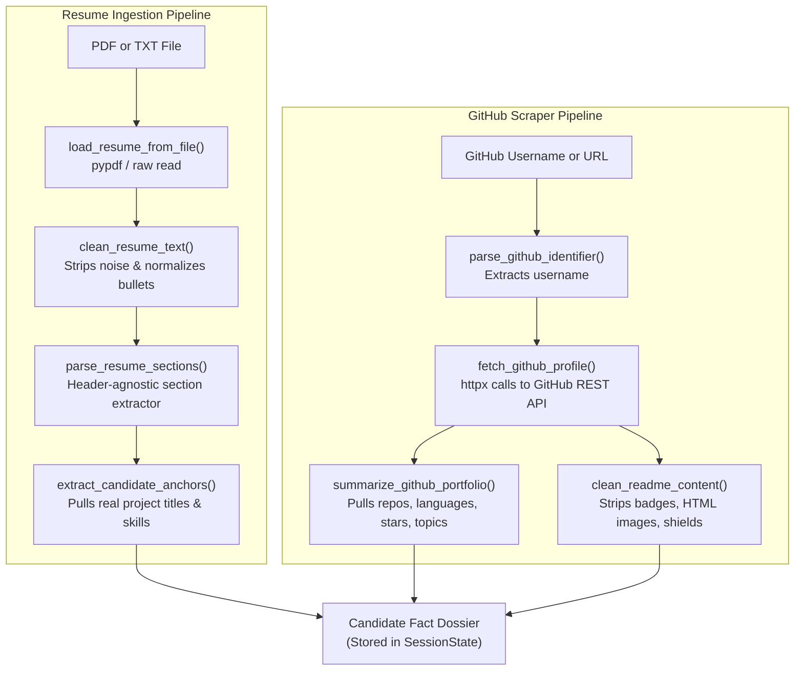

# 05. Ingestion & Portfolio Scraper Pipeline

[← Back to Wiki Index](file:///c:/Users/Bhukya%20Shrikanth/OneDrive/Desktop/Interview-agent/wiki/INDEX.md) | [Next: 06. API Lifecycle & Evaluation →](file:///c:/Users/Bhukya%20Shrikanth/OneDrive/Desktop/Interview-agent/wiki/06_API_AND_LIFECYCLE.md)

---

## 📥 Ingestion Pipeline Overview

The Ingestion subsystem ingests raw candidate inputs (PDF or plain text resumes, and GitHub profile handles/URLs), cleanses formatting noise, extracts logical sections, and builds the verified fact catalog.

---

## 📄 Resume Loader Specification

Implemented in [`app/ingestion/resume_loader.py`](file:///c:/Users/Bhukya%20Shrikanth/OneDrive/Desktop/Interview-agent/app/ingestion/resume_loader.py).

### Key Functions
1. [`clean_resume_text(raw_text: str) -> str`](file:///c:/Users/Bhukya%20Shrikanth/OneDrive/Desktop/Interview-agent/app/ingestion/resume_loader.py#L15-L45):
   - Strips non-printable ASCII noise and carriage returns.
   - Normalizes unicode bullet points (`•`, `▪`, `►`, `*`) into standardized hyphens (`-`).
   - Collapses redundant consecutive whitespace and blank lines.
2. [`parse_resume_sections(cleaned_text: str) -> Dict[str, str]`](file:///c:/Users/Bhukya%20Shrikanth/OneDrive/Desktop/Interview-agent/app/ingestion/resume_loader.py#L48-L105):
   - Uses fuzzy regex matching to segment text into logical buckets:
     `experience`, `projects`, `skills`, `education`, `summary`.
   - **Header-Agnostic**: Does not fail if a candidate uses custom titles like *"Where I've Worked"* or *"Technical Toolkit"*.
3. [`extract_candidate_anchors(resume_text: str) -> List[str]`](file:///c:/Users/Bhukya%20Shrikanth/OneDrive/Desktop/Interview-agent/app/agent/grounding.py#L655-L720):
   - Identifies candidate-owned projects and key technical systems to seed the Turn 1 opening question.

---

## 🐙 GitHub Portfolio Scraper Specification

Implemented in [`app/ingestion/github_loader.py`](file:///c:/Users/Bhukya%20Shrikanth/OneDrive/Desktop/Interview-agent/app/ingestion/github_loader.py).

### Key Functions
1. [`extract_github_username(url_or_username: str) -> str`](file:///c:/Users/Bhukya%20Shrikanth/OneDrive/Desktop/Interview-agent/app/ingestion/github_loader.py#L20-L40):
   - Extracts username from raw strings, e.g. `"https://github.com/torvalds"` or `"@torvalds"`.
2. [`load_github_profile(username: str, client: httpx.AsyncClient) -> Dict[str, Any]`](file:///c:/Users/Bhukya%20Shrikanth/OneDrive/Desktop/Interview-agent/app/ingestion/github_loader.py#L45-L120):
   - Fetches public profile metadata (bio, company, public repo count).
   - Scrapes public non-fork repositories, sorted by stars and recency.
   - Pulls repository `name`, `description`, `language`, `topics`, and `default_branch`.
3. [`clean_readme_content(raw_readme: str) -> str`](file:///c:/Users/Bhukya%20Shrikanth/OneDrive/Desktop/Interview-agent/app/ingestion/github_loader.py#L125-L160):
   - Strips shields.io markdown badges, image links, and license headers.
   - Extracts the first 1,200 characters of meaningful architectural descriptions.
