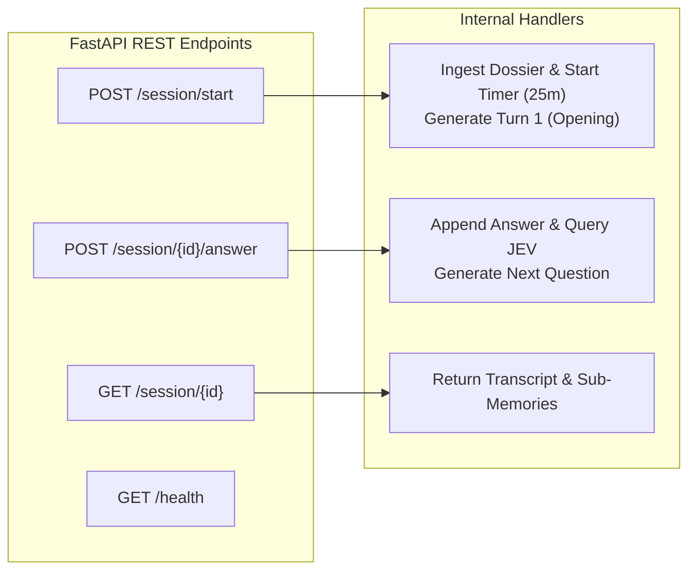
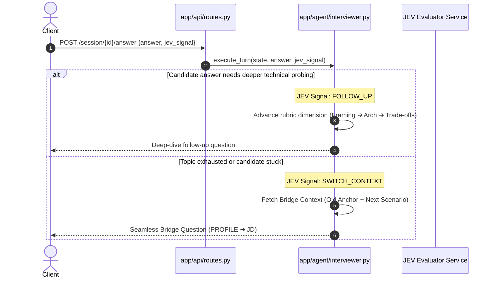

# 06. API Lifecycle & JEV Evaluation Handshake

[← Back to Wiki Index](file:///c:/Users/Bhukya%20Shrikanth/OneDrive/Desktop/Interview-agent/wiki/INDEX.md)

---

## 🌐 FastAPI REST API Architecture

The Interview Agent exposes a clean, asynchronous REST API built with FastAPI, defined in [`app/api/routes.py`](file:///c:/Users/Bhukya%20Shrikanth/OneDrive/Desktop/Interview-agent/app/api/routes.py).



---

## 📋 Endpoint Specifications & Code Links

### 1. `POST /session/start`
Route Handler: [`start_interview_session`](file:///c:/Users/Bhukya%20Shrikanth/OneDrive/Desktop/Interview-agent/app/api/routes.py#L35-L95)
- **Purpose**: Initializes a new interview session and emits the opening greeting (Turn 1).
- **Request Body** ([`StartSessionRequest`](file:///c:/Users/Bhukya%20Shrikanth/OneDrive/Desktop/Interview-agent/app/api/schemas.py)):
  ```json
  {
    "resume_text": "Experienced Python and Redis Backend Engineer...",
    "github_url": "https://github.com/candidate",
    "starting_theme": "PROFILE", // Optional: "PROFILE" or "JD" (defaults to random)
    "llm_provider": "openrouter",
    "model_name": "anthropic/claude-3.5-sonnet"
  }
  ```
- **Response Body** ([`StartSessionResponse`](file:///c:/Users/Bhukya%20Shrikanth/OneDrive/Desktop/Interview-agent/app/api/schemas.py)):
  ```json
  {
    "session_id": "sess_89a712f4",
    "status": "active",
    "turn_count": 1,
    "opening_question": {
      "question": "Welcome! Looking over your experience and background, you highlighted your project 'distributed-cache'...",
      "turn_type": "github_project",
      "source": "github",
      "source_ref": "distributed-cache",
      "reasoning_note": "Anchoring opening turn in candidate's flagship GitHub repository."
    }
  }
  ```

---

### 2. `POST /session/{session_id}/answer`
Route Handler: [`submit_candidate_answer`](file:///c:/Users/Bhukya%20Shrikanth/OneDrive/Desktop/Interview-agent/app/api/routes.py#L100-L160)
- **Purpose**: Ingests candidate's answer, receives external JEV evaluation, and emits the next question.
- **Request Body** ([`AnswerRequest`](file:///c:/Users/Bhukya%20Shrikanth/OneDrive/Desktop/Interview-agent/app/api/schemas.py)):
  ```json
  {
    "answer": "We implemented a two-tier LRU cache with mutex locks to prevent race conditions during stampedes.",
    "jev_signal": "FOLLOW_UP" // Or "SWITCH_CONTEXT"
  }
  ```
- **Response Body** ([`TurnResponse`](file:///c:/Users/Bhukya%20Shrikanth/OneDrive/Desktop/Interview-agent/app/api/schemas.py)):
  ```json
  {
    "session_id": "sess_89a712f4",
    "turn_index": 2,
    "question": "You mentioned using mutex locks with two-tier LRU. How did you structure lock granularity so concurrent reads weren't blocked during eviction?",
    "turn_type": "follow_up",
    "source": "github",
    "source_ref": "distributed-cache",
    "status": "active",
    "budget": {
      "elapsed_seconds": 184,
      "max_duration_seconds": 1500,
      "current_turn": 2
    }
  }
  ```

---

### 3. `GET /session/{session_id}`
Route Handler: [`get_session_details`](file:///c:/Users/Bhukya%20Shrikanth/OneDrive/Desktop/Interview-agent/app/api/routes.py#L165-L195)
- **Purpose**: Returns the full session state, transcript turns, active sub-memory metadata, and covered topics.

---

## 🤝 JEV Evaluator Handshake Specification

The Interviewer Agent coordinates with an external scoring module called `jev` (built by your teammate):



### JEV Handshake Schema
```json
{
  "session_id": "sess_89a712f4",
  "turn_index": 3,
  "active_theme": "PROFILE",
  "active_context_id": "github:distributed-cache",
  "candidate_answer": "...",
  "jev_signal": "FOLLOW_UP | SWITCH_CONTEXT"
}
```

---

[← Back to Wiki Index](file:///c:/Users/Bhukya%20Shrikanth/OneDrive/Desktop/Interview-agent/wiki/INDEX.md)
