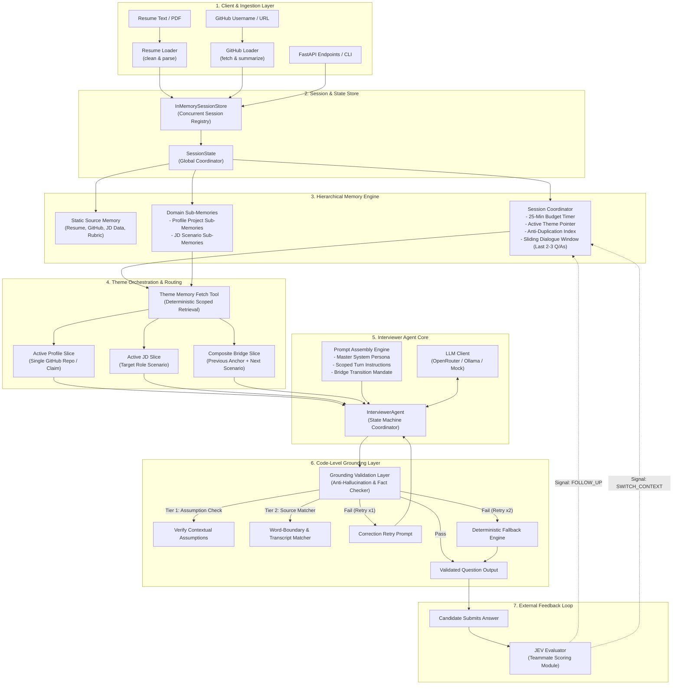

# AI Interview Agent: Codebase Visual Wiki & Architecture Graph

Welcome to the **Visual Architecture Wiki** for the AI Interview Agent backend. This knowledge base provides an interconnected visual map of the entire system, detailing how conversational state machines, hierarchical memory, grounding verification, and multi-theme questioning operate together.

### 🚀 Interactive Localhost Visualizer
To run the interactive visual graph in your browser just like OpenWiki:
```bash
python visualize.py
# or
python -m wiki.visualize
```
This spins up a local server on `http://127.0.0.1:8050`, opens your browser, and provides an interactive force-directed graph with real-time search, subsystem filters, guided pathway highlights, and rendered documentation/source code inspection.

---

## 🗺️ Master System Architecture Graph



---

## 📚 Visual Wiki Navigation Directory

Click on any module below to inspect its detailed architecture, data flows, and code linkages:

| # | Topic | Description | Direct Code Links |
| :--- | :--- | :--- | :--- |
| **01** | [**System Architecture & Topology**](file:///c:/Users/Bhukya%20Shrikanth/OneDrive/Desktop/Interview-agent/wiki/01_SYSTEM_ARCHITECTURE.md) | High-level module dependencies, design boundaries, and zero-RAG philosophy | [`app/main.py`](file:///c:/Users/Bhukya%20Shrikanth/OneDrive/Desktop/Interview-agent/app/main.py), [`app/config.py`](file:///c:/Users/Bhukya%20Shrikanth/OneDrive/Desktop/Interview-agent/app/config.py) |
| **02** | [**Memory & State Machine Graph**](file:///c:/Users/Bhukya%20Shrikanth/OneDrive/Desktop/Interview-agent/wiki/02_MEMORY_AND_STATE_GRAPH.md) | 3-tier memory hierarchy, sub-memories, sliding dialogue window, and 25-minute timer | [`app/session/state.py`](file:///c:/Users/Bhukya%20Shrikanth/OneDrive/Desktop/Interview-agent/app/session/state.py), [`app/session/store.py`](file:///c:/Users/Bhukya%20Shrikanth/OneDrive/Desktop/Interview-agent/app/session/store.py) |
| **03** | [**Themes & Interviewer Engine**](file:///c:/Users/Bhukya%20Shrikanth/OneDrive/Desktop/Interview-agent/wiki/03_THEMES_AND_INTERVIEWER.md) | `PROFILE` vs. `JD` themes, rubric progression ladder, and composite bridge questions | [`app/agent/interviewer.py`](file:///c:/Users/Bhukya%20Shrikanth/OneDrive/Desktop/Interview-agent/app/agent/interviewer.py), [`app/agent/theme_fetcher.py`](file:///c:/Users/Bhukya%20Shrikanth/OneDrive/Desktop/Interview-agent/app/agent/theme_fetcher.py) |
| **04** | [**Grounding & Anti-Hallucination Guardrails**](file:///c:/Users/Bhukya%20Shrikanth/OneDrive/Desktop/Interview-agent/wiki/04_GROUNDING_AND_GUARDRAILS.md) | 2-tier validation, word-boundary assertions, transcript attribution, and deterministic fallbacks | [`app/agent/grounding.py`](file:///c:/Users/Bhukya%20Shrikanth/OneDrive/Desktop/Interview-agent/app/agent/grounding.py) |
| **05** | [**Ingestion & Portfolio Scraper Pipeline**](file:///c:/Users/Bhukya%20Shrikanth/OneDrive/Desktop/Interview-agent/wiki/05_INGESTION_PIPELINE.md) | Resume cleaning, section extraction, GitHub API ingestion, and verified candidate anchor extraction | [`app/ingestion/resume_loader.py`](file:///c:/Users/Bhukya%20Shrikanth/OneDrive/Desktop/Interview-agent/app/ingestion/resume_loader.py), [`app/ingestion/github_loader.py`](file:///c:/Users/Bhukya%20Shrikanth/OneDrive/Desktop/Interview-agent/app/ingestion/github_loader.py) |
| **06** | [**API Lifecycle & JEV Evaluation Handshake**](file:///c:/Users/Bhukya%20Shrikanth/OneDrive/Desktop/Interview-agent/wiki/06_API_AND_LIFECYCLE.md) | FastAPI endpoint lifecycles (`/start`, `/answer`), request/response schemas, and external JEV signals | [`app/api/routes.py`](file:///c:/Users/Bhukya%20Shrikanth/OneDrive/Desktop/Interview-agent/app/api/routes.py), [`app/api/schemas.py`](file:///c:/Users/Bhukya%20Shrikanth/OneDrive/Desktop/Interview-agent/app/api/schemas.py) |

---

## ⚡ Core Engineering Invariants

1. **NO Vector DB / NO RAG**: The system never chunks or embeds documents into vector databases. Everything is resolved using scoped Python dictionaries and sliding windows.
2. **Deterministic Context Scoping**: Inactive repositories and past conversational chapters are omitted from LLM prompts to prevent token bloat and hallucination.
3. **Traceability**: Every question emitted is tagged with `source`, `source_ref`, `rubric_dimension`, and `reasoning_note`.
4. **25-Minute Session Limit**: The session state tracks total duration and turn count, concluding gracefully at minute 22 or turn 11.
